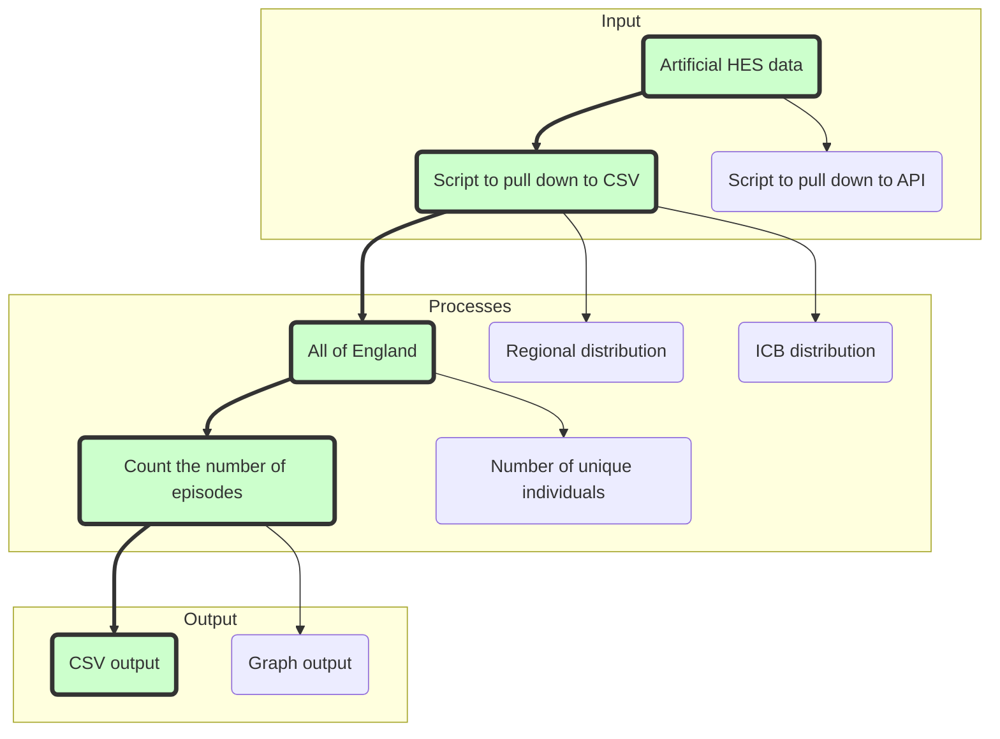

# RAP Example Pipeline - Python using R

:exclamation: Warning: this repository may contain references internal to NHS England that cannot be accessed publicly

This repo contains a simple example pipeline to act as an example of RAP good-practice with R.

## Processes Flow-chart




## Contact
**This repository is maintained by the NHS England Data Science Team**.
> _To contact us raise an issue on Github or via [email](mailto:england.rapchampions@nhs.net)._
> 
> See our (and our colleagues') other work here: [NHS England Analytical Services](https://github.com/NHSDigital/data-analytics-services)

## Description

[Reproducible Analytical Pipelines](https://nhsdigital.github.io/rap-community-of-practice/) can seem quite abstract - so this repo is meant to serve as a real example, that anyone can run, to see RAP in action with R.

The pipeline uses artificial HES data, which was chosen as it is "like" real data used in our industry, but also freely available. 

The pipeline follows three steps which are common to almost all analytical pipelines:

1. Getting the data - in this case we download the artificial HES data as a CSV which is saved into folder called 'data_in' on your machine (see the code in src/data_ingestion)
2. Processing the data - the data is aggregated using R (the code for this is in src/data_processing)
3. Saving the processed data - the processed data is saved as a csv in a folder called 'data_out' (see the code in src/data_exports)

## Prerequisites

This code requires R version 4.3.2 (2023-10-31, nickname: Eye Holes), the R Project website has [instructions for downloading and installing R](https://www.r-project.org/).

## Getting Started

1. Clone the repository. To learn about what this means, and how to use Git, see the [Git guide](https://nhsdigital.github.io/rap-community-of-practice/training_resources/git/using-git-collaboratively/).

```
git clone https://github.com/NHSDigital/RAP_example_pipeline_python
```

2. Make sure you have packrat installed. From the R console:

`install.packages("packrat")`

3. Install dependencies:

`packrat::restore()`

## Running the pipeline

To run the pipeline, run the create_publication.r file, either by running that file in your IDE (RStudio, VS Code etc.) or from the command line with the following line, making sure you are in the root folder of the project:

`Rscript create_publication.r`

## Running the tests
There are two sets of tests in this structure (and you can see guidance on them by following the hyperlinks): 

* **[Unit tests](https://nhsdigital.github.io/rap-community-of-practice/training_resources/python/unit-testing/)**: these test functions in isolation to ensure they do what you expect them to.
* **[Back tests](https://nhsdigital.github.io/rap-community-of-practice/training_resources/python/backtesting/)**: TBC
<!-- * **[Back tests](https://nhsdigital.github.io/rap-community-of-practice/training_resources/python/backtesting/)**: when you refactor a pipeline or re-create it entirely, it's a good idea to compare the results of the old process (often referred to as the "ground truth") to the results of the new pipeline. This is what the back tests do. Here, the back tests will first check if the output files exist in the data_out folder, and if not, it will run the pipeline and create these files so that it can compare them to the ground truth files (stored in the `tests/backtests/ground_truth/` folder). Note that you don't need to commit your ground truth files to your repo (for example if they are very large or contain sensitive data). -->

Testing is done with the testthat package. Testthat will automatically run all R files starting with `test` within the `tests/testthat/`folder. However, this may become unwieldy with larger projects and multiple subfolders in the`src/` directory.

To organise the tests, you can match the folder structure in `tests/testthat` to the one in `src/`, and then run the `run_tests.r` file in the root directory of the project. This will scan through all subfolders in `tests/testthat` and run any test files it finds.

So either run that file in your IDE (RStudio, VS Code etc.), or from the command line with the following line, making sure you are in the root folder of the project:

`Rscript run_tests.r`

## Project structure

```text
|   .gitignore                        <- Files (& file types) automatically removed from version control
|   config.yml                        <- Configuration file with parameters we want to be able to change
|   .RProfile                         <- Profile (generated by testthat)
|   LICENCE                           <- License info for public distribution
|   README.md                         <- Quick start guide / explanation of the project
|
|   create_publication.r              <- Runs the overall pipeline to produce the publication     
|   run_tests.r                       <- Runs the tests
|
+---data_in                           <- Data downloaded from external sources can be saved here. Files in here will not be committed
|   |       .gitkeep                  <- This is a placeholder file that enables the otherwise empty directory to be committed
|   |
+---data_out                          <- Any data saved as files will be stored here. Files in here will not be committed
|   |       .gitkeep                  <- This is a placeholder file that enables the otherwise empty directory to be committed
|   |
+---packrat                           <- Files used by packrat, the dependency management package
|   |       init.R                    <- Auto generated by packrat. This file should not be edited. Should not be edited.
|   |       packrat.lock              <- Auto generated by packrat. Lists packages/versions installed. Should not be edited.
|   |       packrat.opts              <- Auto generated by packrat. Contains packrat config settings.
|   |
+---src                               <- Scripts with functions for use in 'create_publication.r'. Contains the project's codebase.
|   |
|   +---data_exports
|   |       .gitkeep                  <- This is a placeholder file that enables the otherwise empty directory to be committed
|   |
|   +---data_ingestion                <- functions to import and preprocess data
|   |       .gitkeep                  <- This is a placeholder file that enables the otherwise empty directory to be committed
|   |       import_data.r             <- Gets data from external sources
|   |
|   +---data_processing               <- functions to process data i.e. clean and derive new fields, create aggregations etc.
|   |       .gitkeep                  <- This is a placeholder file that enables the otherwise empty directory to be committed
|   |       aggregations.r           <- Functions that create the aggregate counts needed in the outputs
|   | 
|   +---utils                         <- utility functions not captured by the folder above
|   |       .gitkeep                  <- This is a placeholder file that enables the otherwise empty directory to be committed
|   | 
+---tests
|   |
|   +---testthat                      <- Auto-generated by the testthat package
|   |   |
|   |   +---test_data_processing      <- Tests functions in src/data_processing
|   |           test-aggregations.r   <- Tests functions in src/data_processing/aggregations.r
|   |   |
|   |   +---test_example              <- Another example test file, to demonstrate how testing across multiple subdirectories works
|   |           test_example.r        <- Contains a simple test that always passes
|   |   |
+---.devcontainer
|   |       devcontainer.json         <- Set up file for GitHub Codespaces, launches an unbuntu machine with R pre-installed
```

### `root`

In the highest level of this repository (known as the 'root'), there are two R files: `create_publication.r` and `run_tests.r` (see above for more info). The `create_publication.r` file should be the main place where users interact with the code, where you store the steps to create your publication.

This file currently runs a set of example steps using example data.

### `src`

This directory contains the meaty parts of the code. By organising the code into logical sections, we make it easier to understand, maintain and test. Moreover, tucking the complex code out of the way means that users don't need to understand everything about the code all at once.

### `tests`

This folder contains the tests for the code base. It's good practice to have unit tests for your functions at the very least, ideally in addition to tests of the pipeline as a whole such as backtests.

-----------

## Licence

This codebase is released under the MIT License. This covers both the codebase and any sample code in the documentation.

Any HTML or Markdown documentation is [© Crown copyright](https://www.nationalarchives.gov.uk/information-management/re-using-public-sector-information/uk-government-licensing-framework/crown-copyright/) and available under the terms of the [Open Government 3.0 licence](https://www.nationalarchives.gov.uk/doc/open-government-licence/version/3/).

## Acknowledgements
- [The RAP team](https://github.com/NHSDigital/rap-community-of-practice)!
